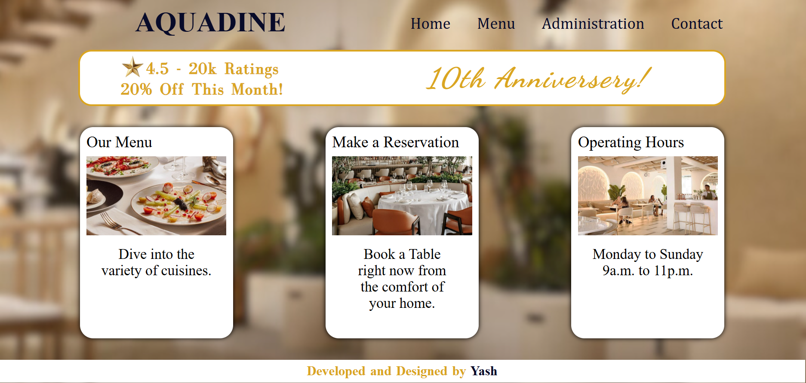
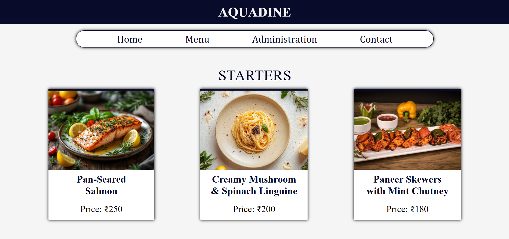
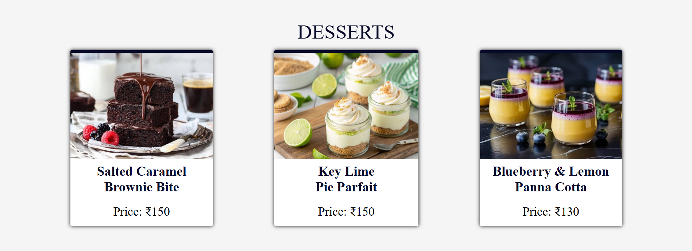
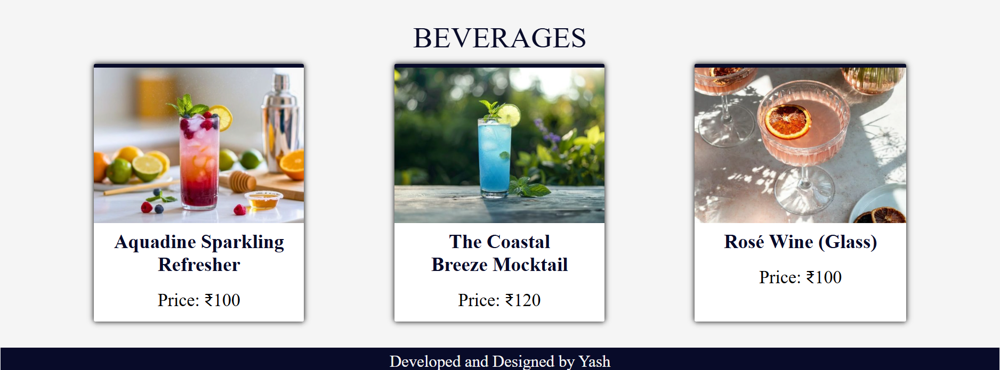
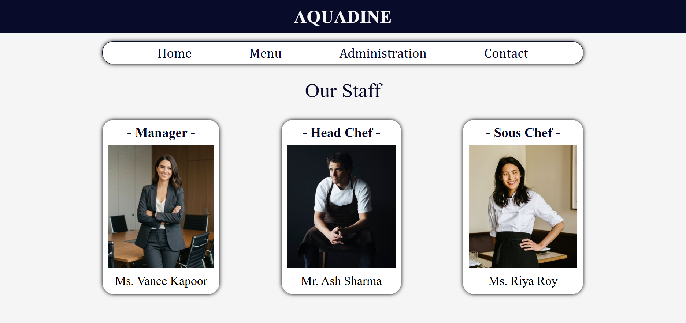
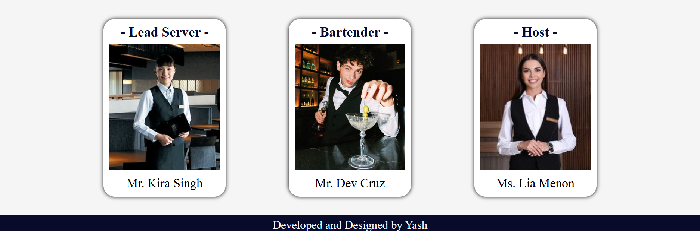
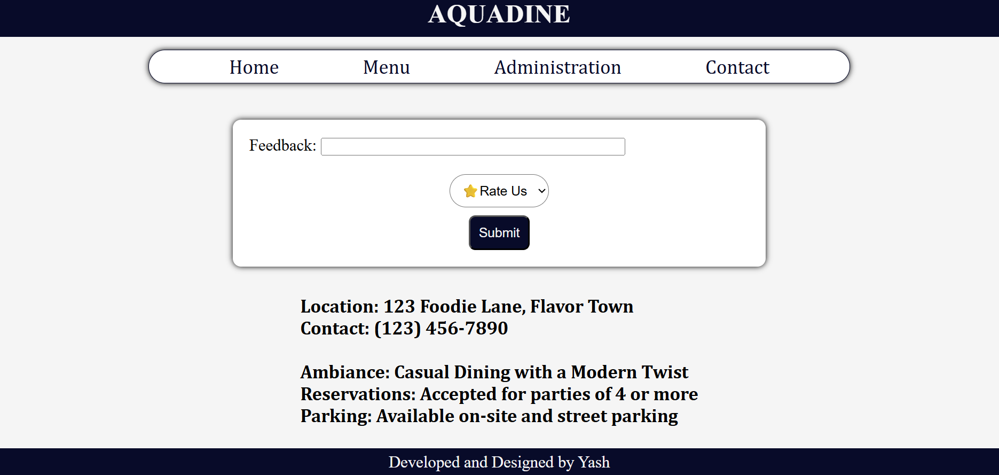

# Ex.06 Restaurant Website
# Date: 09.12.2025
# AIM:
To develop a static Restaurant website to display the food items and services provided by them.

# DESIGN STEPS:
## Step 1:
Requirement collection.

## Step 2:
Creating the layout using HTML and CSS.

## Step 3:
Updating the sample content.

## Step 4:
Choose the appropriate style and color scheme.

## Step 5:
Validate the layout in various browsers.

## Step 6:
Validate the HTML code.

## Step 7:
Publish the website in the given URL.

# PROGRAM:
urls.py:
```
from django.contrib import admin
from django.urls import path
from restroapp import views

urlpatterns = [
    path('admin/', admin.site.urls),
    path('',views.restrohome,name="home"),
    path('menu/',views.menupage,name="menu"),
    path('adminpg/',views.adminpage,name="adm"),
    path('contact_info/',views.contactus,name="cont"),
]
```
views.py:
```
from django.shortcuts import render
def restrohome(request):
    return render(request,'restro.html')
def menupage(request):
    return render(request,'menu.html')
def adminpage(request):
    return render(request,'administration.html')
def contactus(request):
    return render(request,'contact.html')
```
restro.html:
```

<html lang="en">
    <head>
        <title>AQUADINE</title>
        <style>
            @font-face {
                font-family: 'Anni';
                src: url("") format('woff2'),
            }
            @font-face {
                font-family: 'Disc';
                src: url("") format('woff2'),
            }
            body{
                background-image: url("");
                background-repeat: no-repeat;
                background-size: 115%;
                background-position: -130px -190px;
            }
            h1{
                font-size: 36px;
                margin-left: 130px;
                margin-top: 15px;
            }
            .header{
                font-size: 24px;
                margin-top: -5.8%;
                margin-left: 50.6%;
            }
            .header nav{
                display: flex;
                flex-direction: row;
                gap: 30px;
                /* margin-left: 54%; */
            }
            .header a{
                padding-left: 5px;
                padding-right: 5px;
                padding-top: 5px;
                padding-bottom: 5px;
                border-radius: 15px;
                align-content: center;
                justify-items: center; 
                color:#080b29;
                text-decoration: none;
                font-family: Cambria, Cochin, Georgia, Times, 'Times New Roman', serif;
            }
            .discount{
                position: relative;
                background-color: white;
                margin: 22px auto;
                height: 80px;
                width:80%;
                border-radius: 20px;
                /* box-shadow: 0px 0px 4px gold; */
                border: 3px solid goldenrod;
            }
            .discount img{
                position: relative;
                height: 40px;
                width:auto;
                left:60px;
                top:3px;
            }
            .discount h2{
                position: absolute;
                margin: 15px auto;
                right: 12%;
                font-size: 42px;
                font-family: 'Anni',sans-serif;
                letter-spacing: 3px;
                font-style: italic;
                color: goldenrod;
            }
            .discount h3{
                position: absolute;
                font-size: 25px;
                left: 100px;
                color: goldenrod;
                font-family: 'Disc',sans-serif;
                bottom: 15px;
                letter-spacing: 1px;
                word-spacing: 3px;
            }
            .discount h1{
                color: goldenrod;
                position: absolute;
                font-size: 25px;
                left: -7%;
                font-family: 'Disc',sans-serif;
                bottom: -10%;
                letter-spacing: 1px;
                word-spacing: 3px;
            }
            .box{
                display: flex;
                flex-direction: column;
                background-color: white;
                box-shadow: 0px 0px 7px black;
                height: 320px;
                width:300px;
                border-radius: 20px;
            }
            .box h1{
                text-align: left;
                font-size: 24px;
                color: black;
                font-weight: lighter;
                margin:8px 10px ;
            }
            .box h2{
                text-align: center;
                font-size: 22px;
                color: black;
                font-weight: lighter;
                margin:16px 10px;
            }
            .box img{
                height: 120px;
                width: auto;
                padding-left:10px;
                padding-right:10px;
            }
            .inrow{
                display: flex;
                flex-direction: row;
                max-width: 80%;
                margin: 32px auto;
                justify-content: space-evenly;
                gap:140px;   
            }
            .MyName{
                background-color: white;
                color: goldenrod;
                height: 35px;
                width: 100%;
                margin-bottom: 10px;
                text-align: center;
                font-size: 20px;
                font-weight: bold;
                align-content: center;
                margin:10px,0px;
                word-spacing: 2px;
            }
        </style>
    </head>
    <body>
        <h1 style="color: #080b29;margin-left: 205px;font-size: 42px;margin-top: 10px;">AQUADINE</h1>
        <div class="header">
            <nav>
            <a href="">Home</a>
            <a href="">Menu</a>
            <a href="">Administration</a>
            <a href="">Contact</a>
            </nav>
        </div>
        <div class="discount">
            <h2>10th Anniversery!</h2>
            
            <h3>4.5 - 20k Ratings</h3>
            <h1>20% Off This Month!</h1>
        </div>
        <div class="inrow">
            <div class="box">
                <h1>Our Menu</h1>
                
                <h2>Dive into the<br>variety of cuisines.</h2>
            </div>
            <div class="box">
                <h1>Make a Reservation</h1>
                
                <h2>Book a Table<br>right now from<br>the comfort of<br>    your home.</h2>
            </div>
            <div class="box">
                <h1>Operating Hours</h1>
                
                <h2>Monday to Sunday<br>9a.m. to 11p.m.</h2>
            </div>
        </div>
        <div class="MyName">
            Developed and Designed by <span style="color: #080b29;">Yash</span>
        </div>
    </body>
</html>
```
menu.html:
```

<html lang="en">
    <head>
        <title>MENU</title>
        <style>
            body{
                background-color: whitesmoke;
            }
            .resname h1{
                background-color: #080b29;
                color: whitesmoke;
                padding: 10px;
                text-align: center;
            }
            .header{
                border: 1px solid #080b29;
                background-color: white;
                box-shadow: 0px 0px 7px black;
                border-radius: 20px;
                width:70%;
                height:7%;
                font-size: 24px;
                margin: -0.5% auto;
                display: flex;
                justify-content: center;
                align-items: center;
            }
            .header nav{
                display: flex;
                flex-direction: row;
                gap: 92px;
            }
            .header a{
                padding-left: 5px;
                padding-right: 5px;
                padding-top: 5px;
                padding-bottom: 5px;
                border-radius: 15px;
                color:#080b29;
                text-decoration: none;
                font-family: Cambria, Cochin, Georgia, Times, 'Times New Roman', serif;
            }
            span h1{
                text-align: center;
                margin-top: 32px;
                margin-bottom: -20px;
                font-size: 36px;
                font-weight: lighter;
                color: #080b29;
            }
            .box{
                display: flex;
                flex-direction: column;
                background-color: white;
                box-shadow: 0px 0px 7px black;
                height: 310px;
                width:auto;
                border-radius: 2px;
                border-top: 5px solid #080b29;
            }
            .box h1{
                text-align: center;
                font-size: 24px;
                color: #080b29;
                /* font-weight: lighter; */
                margin:8px 15px ;
            }
            .box h2{
                text-align: center;
                font-size: 22px;
                color: black;
                font-weight: lighter;
                margin:10px 10px;
            }
            .box img{
                height: 190px;
                width:auto;
                /* padding-left:10px;
                padding-right:10px; */
            }
            .inrow{
                display: flex;
                flex-direction: row;
                margin: 32px auto;
                justify-content: space-evenly;
                gap:110px; 
                max-width: 83%;  
            }
            .container{
                display: flex;
                flex-direction: column;
                margin-top: 20px;
            }
            .MyName{
                background-color: #080b29;
                color: whitesmoke;
                height: 35px;
                width:100%;
                text-align: center;
                font-size: 20px;
                align-content: center;
                margin-bottom: -0.6%;
            }
        </style>
    </head>
    <body>
        <div class="resname">
        <h1>AQUADINE</h1>
        </div>
        <div class="header">
            <nav>
            <a href="">Home</a>
            <a href="">Menu</a>
            <a href="">Administration</a>
            <a href="">Contact</a>
            </nav>
        </div>
        <div class="container">
            <span><h1>STARTERS</h1></span>
            <div class="inrow">
                <div class="box">
                    
                    <h1>Pan-Seared <br>Salmon</h1>
                    <h2>Price: ₹250</h2>
                </div>
                <div class="box">
                    
                    <h1>Creamy Mushroom <br>& Spinach Linguine</h1>
                    <h2>Price: ₹200</h2>
                </div>
                <div class="box">
                    <!--  -->
                    
                    <h1>Paneer Skewers <br>with Mint Chutney</h1>
                    <h2>Price: ₹180</h2>
                </div>
            </div>
            <span><h1>DESSERTS</h1></span>
            <div class="inrow">
                <div class="box">
                    
                    <h1>Salted Caramel <br>Brownie Bite</h1>
                    <h2>Price: ₹150</h2>
                </div>
                <div class="box">
                    
                    <h1>Key Lime <br>Pie Parfait</h1>
                    <h2>Price: ₹150</h2>
                </div>
                <div class="box">
                    
                    <h1>Blueberry & Lemon <br>Panna Cotta</h1>
                    <h2>Price: ₹130</h2>
                </div>
            </div>
            <span><h1>BEVERAGES</h1></span>
            <div class="inrow">
                <div class="box">
                    
                    <h1>Aquadine Sparkling <br>Refresher</h1>
                    <h2>Price: ₹100</h2>
                </div>
                <div class="box">
                    
                    <h1>The Coastal <br>Breeze Mocktail</h1>
                    <h2>Price: ₹120</h2>
                </div>
                <div class="box">
                    
                    <h1>Rosé Wine (Glass)</h1>
                    <h2>Price: ₹100</h2>
                </div>
            </div>
        </div>
        <div class="MyName">
            Developed and Designed by Yash
        </div>
    </body>
</html>
```
administration.html:
```

<html lang="en">
    <head>
        <title>INFORMATION</title>
        <style>
            body{
                background-color: whitesmoke;
            }
            .resname h1{
                background-color: #080b29;
                color: whitesmoke;
                padding: 10px;
                text-align: center;
            }
            .header{
                border: 1px solid #080b29;
                background-color: white;
                box-shadow: 0px 0px 7px black;
                border-radius: 20px;
                width:70%;
                height:7%;
                font-size: 24px;
                margin: -0.5% auto;
                display: flex;
                justify-content: center;
                align-items: center;
            }
            .header nav{
                display: flex;
                flex-direction: row;
                gap: 92px;
            }
            .header a{
                padding-left: 5px;
                padding-right: 5px;
                padding-top: 5px;
                padding-bottom: 5px;
                border-radius: 15px;
                color:#080b29;
                text-decoration: none;
                font-family: Cambria, Cochin, Georgia, Times, 'Times New Roman', serif;
            }
            span h1{
                text-align: center;
                margin-top: 32px;
                margin-bottom: -20px;
                font-size: 36px;
                font-weight: lighter;
                color: #080b29;
            }
            .box{
                display: flex;
                flex-direction: column;
                background-color: white;
                box-shadow: 0px 0px 7px black;
                height: 310px;
                width:auto;
                border-radius: 20px;
            }
            .box h1{
                text-align: center;
                font-size: 24px;
                color: #080b29;
                /* font-weight: lighter; */
                margin:8px 15px ;
            }
            .box h2{
                text-align: center;
                font-size: 22px;
                color: black;
                font-weight: lighter;
                margin:10px 10px;
            }
            .box img{
                height: 220px;
                width:auto;
                padding-left:10px;
                padding-right:10px;
            }
            .inrow{
                display: flex;
                flex-direction: row;
                margin: 32px auto;
                justify-content: space-evenly;
                gap:110px;   
            }
            .container{
                display: flex;
                flex-direction: column;
                margin-top: 20px;
            }
            .MyName{
                background-color: #080b29;
                color: whitesmoke;
                height: 35px;
                width:100%;
                text-align: center;
                font-size: 20px;
                align-content: center;
                margin-bottom: -0.6%;
            }
        </style>
    </head>
    <body>
        <div class="resname">
        <h1>AQUADINE</h1>
        </div>
        <div class="header">
            <nav>
            <a href="">Home</a>
            <a href="">Menu</a>
            <a href="">Administration</a>
            <a href="">Contact</a>
            </nav>
        </div>
        <span><h1>Our Staff</h1></span>
        <div class="container">
            <div class="inrow">
                <div class="box">
                    <h1> - Manager - </h1>
                    
                    <h2>Ms. Vance Kapoor</h2>
                </div>
                <div class="box">
                    <h1> - Head Chef - </h1>
                    
                    <h2>Mr. Ash Sharma</h2>
                </div>
                <div class="box">
                    <h1> - Sous Chef - </h1>
                    
                    <h2>Ms. Riya Roy</h2>
                </div>
            </div>
            <div class="inrow">
                <div class="box">
                    <h1> - Lead Server - </h1>
                    
                    <h2>Mr. Kira Singh</h2>
                </div>
                <div class="box">
                    <h1> - Bartender - </h1>
                    
                    <h2>Mr. Dev Cruz</h2>
                </div>
                <div class="box">
                    <h1> - Host - </h1>
                    
                    <h2>Ms. Lia Menon</h2>
                </div>
            </div>
        </div>
        <div class="MyName">
            Developed and Designed by Yash
        </div>
    </body>
</html>
```
contact.html:
```
<html lang="en">
    <head>
        <title>INFORMATION</title>
        <style>
            body{
                background-color: whitesmoke;
            }
            .resname h1{
                background-color: #080b29;
                color: whitesmoke;
                padding: 10px;
                text-align: center;
            }
            .header{
                border: 1px solid #080b29;
                background-color: white;
                box-shadow: 0px 0px 7px black;
                border-radius: 20px;
                width:70%;
                height:7%;
                font-size: 24px;
                margin: -0.5% auto;
                display: flex;
                justify-content: center;
                align-items: center;
            }
            .header nav{
                display: flex;
                flex-direction: row;
                gap: 92px;
            }
            .header a{
                padding-left: 5px;
                padding-right: 5px;
                padding-top: 5px;
                padding-bottom: 5px;
                border-radius: 15px;
                color:#080b29;
                text-decoration: none;
                font-family: Cambria, Cochin, Georgia, Times, 'Times New Roman', serif;
            }
            .feedback{
                margin-top: 50px;
                margin-left: auto;
                margin-right: auto;
                width: 50%;
                font-size: 20px;
                background-color: white;
                box-shadow: 0px 0px 7px black;
                padding: 20px;
                border-radius: 10px;
            }
            .feedback button{
                background-color: #080b29;
                color: whitesmoke;
                padding: 10px;
                border-radius: 8px;
                font-size: 16px;
                cursor: pointer;
                display: block;
                margin-left: auto;
                margin-right: auto;
            }
            .feedback button:hover{
                background-color: #202135;
            }
            .feedback select{
                font-size: 16px;
                padding: 10px;
                margin-bottom: 10px;
                border-radius: 20px;
                display: block;
                margin-left: auto;
                margin-right: auto;
            }
            .info{
                margin-bottom: 8px;
                text-align: justify;
                display: flex;
                justify-content: center;
                font-size: 15px;
                font-family:Cambria, Cochin, Georgia, Times, 'Times New Roman', serif;
            }
            .MyName{
                background-color: #080b29;
                color: whitesmoke;
                height: 35px;
                width:100%;
                text-align: center;
                font-size: 20px;
                align-content: center;
            }
        </style>
    </head>
    <body>
        <div class="resname">
        <h1>AQUADINE</h1>
        </div>
        <div class="header">
            <nav>
            <a href="">Home</a>
            <a href="">Menu</a>
            <a href="">Administration</a>
            <a href="">Contact</a>
            </nav>
        </div>
        <form>
            <div class="feedback">
                Feedback: <input type="text" name="feedback" size="50px"><br><br>
                <select>
                    <option>⭐Rate Us</option>
                    <option value="1">1 Star</option>
                    <option value="2">2 Stars</option>
                    <option value="3">3 Stars</option>
                    <option value="4">4 Stars</option>
                    <option value="5">5 Stars</option>
                </select>
                <button type="submit">Submit</button>
            </div>
        </form>
        <div class="info">
            <h2>
Location: 123 Foodie Lane, Flavor Town<br>
Contact: (123) 456-7890<br><br>
Ambiance: Casual Dining with a Modern Twist<br>
Reservations: Accepted for parties of 4 or more<br>
Parking: Available on-site and street parking<br>
            </h2>
        </div>
        <div class="MyName">
            Developed and Designed by Yash
        </div>
    </body>
</html>
```

# OUTPUT:








# RESULT:
The program for designing software company website using HTML and CSS is completed successfully.
